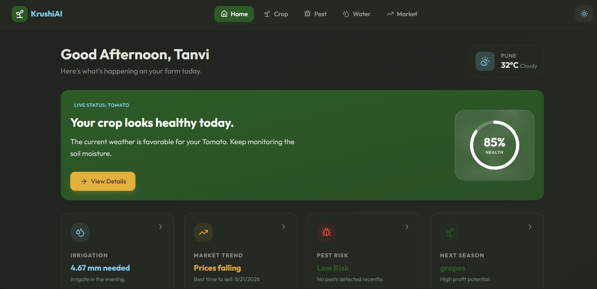
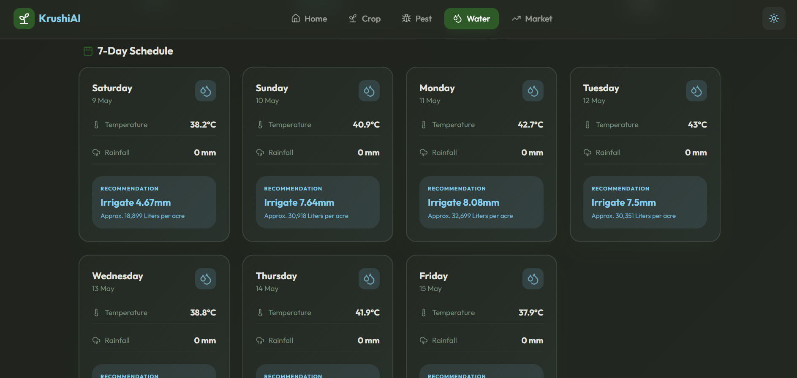
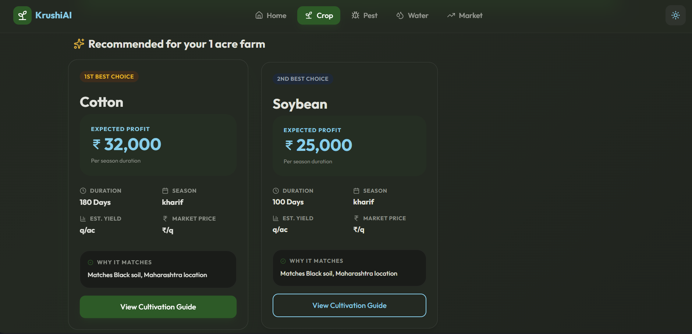
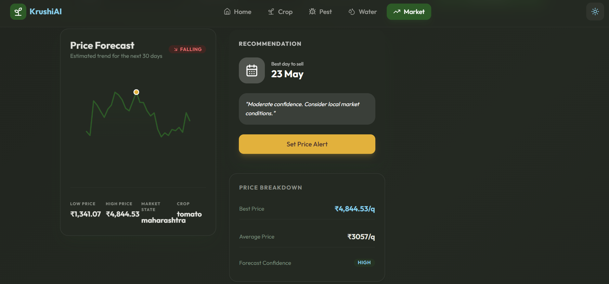
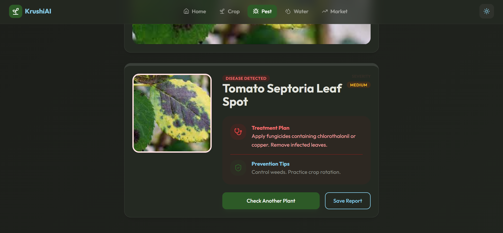
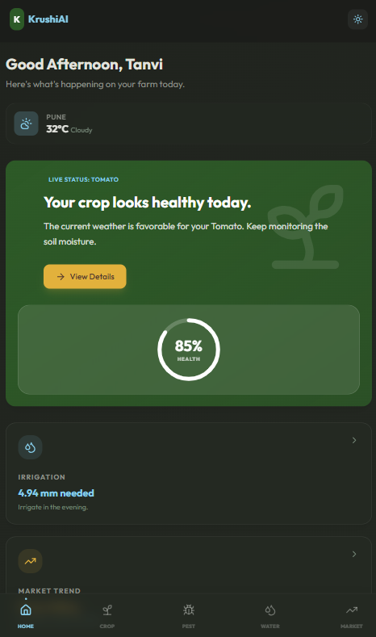
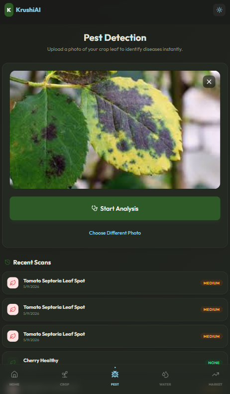
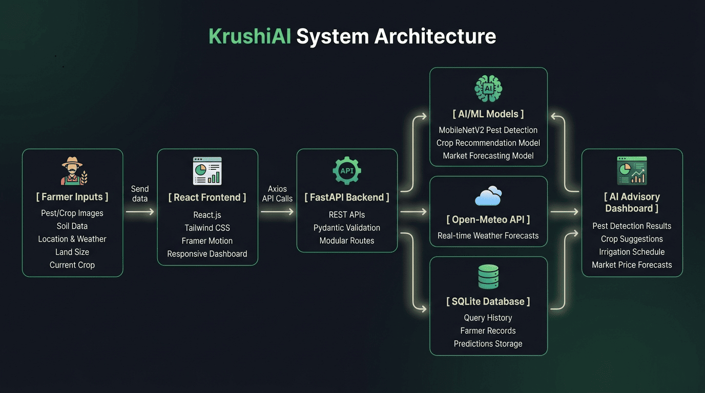

# <div align="center">KrushiAI</div>
<div align="center">
  <h3>AI-Powered Decision Intelligence for Modern Farming</h3>
  <p>A comprehensive agricultural advisory platform leveraging computer vision and predictive analytics to empower Indian farmers with data-driven insights.</p>
</div>

<div align="center">


</div>

---

<div align="center">
  
</div>

<div align="center">

#### [Metrics](#-key-metrics) • [Overview](#-project-overview) • [Modules](#-core-module-showcase) • [Architecture](#-architecture-diagram) • [Tech Stack](#-tech-stack) • [Setup](#-local-setup-instructions)

</div>

---

## 📊 Key Metrics

<div align="center">

| 🤖 AI Modules | 📈 Market Forecasting | 💧 Irrigation Planning | 📱 UI/UX |
| :---: | :---: | :---: | :---: |
| 4 Advisory Engines | 30-Day Predictions | 7-Day Precision Schedule | Fully Responsive |

</div>

---

## 📖 Project Overview

KrushiAI is an AI-powered agricultural advisory platform designed specifically for the needs of Indian farmers. By integrating machine learning, computer vision, and weather intelligence, the platform transforms complex environmental and market data into actionable insights.

The application facilitates precise farming practices, minimizes crop loss due to disease, and optimizes resource management through intelligent forecasting.

---

## 🌱 Why KrushiAI?

Agricultural decision-making is highly fragmented. Farmers often rely on separate systems for weather analysis, disease identification, irrigation planning, and market forecasting.

KrushiAI unifies these critical agricultural workflows into a single AI-powered advisory platform, enabling farmers to make faster, data-driven decisions through one integrated system.

---

## 🖥️ Unified Farmer Dashboard
KrushiAI centralizes agricultural intelligence into a single responsive dashboard for real-time monitoring and decision-making.



---

## 🌾 Core Module Showcase

### 💧 Irrigation Advisor
Integrates high-resolution weather forecasts to generate precision irrigation schedules, helping farmers optimize water usage while maintaining optimal crop health.



---

### 🌾 Crop Advisor
Analyzes soil nutrient profiles (N, P, K) and local climate data to recommend the most compatible crops for maximized yield and long-term sustainability.



---

### 📉 Market Predictor
Forecasts mandi prices and market trends using historical data analysis. This enables farmers to time their harvest and sales for maximum profitability.



---

### 🔍 Pest Detection
Leverages computer vision to identify crop diseases from leaf images. The module provides instant diagnosis with confidence scores and recommended treatments.



---

## 📱 Mobile Experience
The platform is designed with a mobile-first approach, ensuring farmers can access critical AI-driven insights directly from the field with a lightweight, responsive interface.

<div align="center">
  
  &nbsp;&nbsp;&nbsp;&nbsp;
  
</div>

---

## 🏗️ Architecture
The system follows a modern decoupled architecture, ensuring scalability and efficient processing of heavy machine learning inference tasks.



---

## ⚙️ How It Works

### 🔍 Pest Detection

| Stage | Description |
| :--- | :--- |
| **Input** | Farmer uploads a crop leaf image |
| **Processing** | Image preprocessing and feature extraction |
| **AI Engine** | MobileNetV2 + HuggingFace Transformers |
| **Output** | Disease classification with treatment suggestions |

---

### 🌾 Crop Advisor

| Stage | Description |
| :--- | :--- |
| **Input** | Soil nutrients (N, P, K, pH) and climate data |
| **Processing** | Feature scaling and crop compatibility analysis |
| **AI Engine** | scikit-learn ensemble models |
| **Output** | Ranked crop recommendations |

---

### 💧 Irrigation Advisor

| Stage | Description |
| :--- | :--- |
| **Input** | Geo-location and soil moisture estimates |
| **Processing** | Weather analysis and evapotranspiration modeling |
| **AI Engine** | Open-Meteo API + irrigation logic |
| **Output** | 7-day irrigation schedule |

---

### 📉 Market Predictor

| Stage | Description |
| :--- | :--- |
| **Input** | Commodity type and mandi location |
| **Processing** | Historical trend and seasonal analysis |
| **AI Engine** | Time-series forecasting models |
| **Output** | 30-day market price predictions |

---

## 🛠️ Tech Stack

| Category | Technology |
| :--- | :--- |
| **Frontend** | React.js v19, Tailwind CSS, Framer Motion, Axios |
| **Backend** | FastAPI, Python, Pydantic |
| **Machine Learning** | scikit-learn, MobileNetV2, Transformers, Torch |
| **Database** | SQLite (Prototyping) |
| **External APIs** | Open-Meteo API |

---

## 🔌 API Reference

| Endpoint | Method | Purpose |
| :--- | :--- | :--- |
| `/pest/predict` | `POST` | Processes crop image and returns disease diagnosis. |
| `/crop/recommend` | `POST` | Analyzes soil data to recommend suitable crops. |
| `/irrigation/schedule` | `POST` | Generates a 7-day irrigation plan based on weather. |
| `/market/predict` | `POST` | Forecasts commodity prices for the next 30 days. |

---

## 🚀 Local Setup Instructions

### Backend Setup
```bash
cd backend
pip install -r requirements.txt
uvicorn main:app --reload
```

### Frontend Setup
```bash
cd frontend
npm install
npm start
```

---

## 📂 Folder Structure
```text
krushiAi/
├── backend/          # FastAPI server, ML models, and Database
├── frontend/         # React.js application and UI components
├── assets/           # Screenshots, Diagrams, and Logos
└── README.md         # Documentation
```

---

## 🤝 Contributing
Contributions are welcome. Please follow the standard fork-and-pull-request workflow. For major changes, please open an issue first.

---

## 📜 Acknowledgements
- **FAO-56:** Irrigation calculation logic.
- **PlantVillage:** Disease detection dataset.
- **Open-Meteo:** Weather forecast API.
- **Agmarknet:** Historical market price data.

---

## ⚖️ License
Licensed under the [MIT License](LICENSE).

---

## 📩 Contact

<div align="center">

### Tanvi Argade
[GitHub](https://github.com/tanvi-argade) • [LinkedIn](https://www.linkedin.com/in/tanvi-argade/) • [Email](mailto:tanviargade1@gmail.com) • [Portfolio](https://tanvi-argade.github.io/portfolio/)

</div>

---

<div align="center">
Built with React, FastAPI, and Machine Learning for smarter agricultural decision-making.
</div>